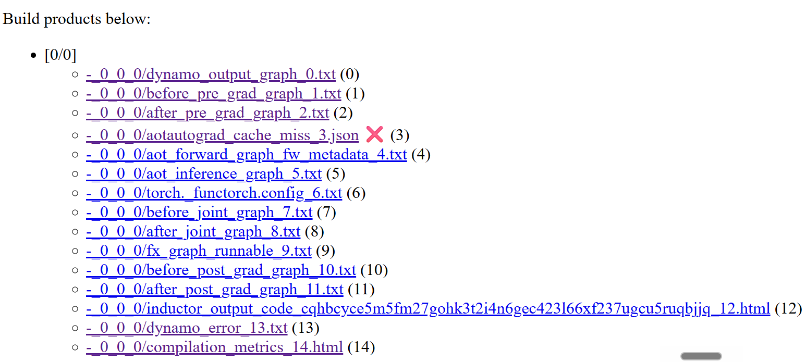

# Compiler-Learnings

## Torch Inductor sizevars.py evaluation failure with point cloud multi-stage execution

### Description
When compiling the Deep learning model with multi-stage pipeline using `torch.compile()`, PyTorch's native Inductor backend crashes during graph optimization. The failure occurs in the symbolic shape tracing engine (`SymPy`). 

### Environment Context
* **GPU:** NVIDIA GeForce RTX 3090 (Compute Capability 8.6)
* **Python Version:** 3.11
* **PyTorch Version:** 2.x (Internal Inductor Compiler Stack)
* **Target Architecture:** DGCNN + Attention 
* **Batch Configuration:** Statically targeted at $B=4$, $N=4096$, $M_d=2048$

### Model Compilation


``` python
compile.py
#load the model, give dummy inputs and run compilation
#Model compiled with backend = "eager", "aot_eager".
compiled_model = torch.compile(model,backend="inductor",mode="default",
                fullgraph=True)
```

```sh
export TORCH_COMPILE_DEBUG=1
export TORCHDYNAMO_VERBOSE=1
export TORCHINDUCTOR_COMPILE_THREADS=1 
export TORCH_LOGS="+inductor,dynamo" 
python compile.py 2>&1 | tee ./inductor_crash.txt
```

### Complete Compilation report

```sh
pip install tlparse
TORCH_TRACE="./report" python compile.py
cd report
tlparse torchtrace/decicated_log_file.log
cd ../tl_out
#from index.html and failure_restarts.html, error stack trace can be seen
```



### Error Stack Trace from inductor.txt
```text
V0528 18:39:59.130405 1669006 .venv/lib/python3.11/site-packages/torch/_inductor/scheduler.py:5380] [0/0_1] Generating code for node op319 with estimated runtime 0.073125
V0528 18:39:59.135891 1669006 .venv/lib/python3.11/site-packages/torch/_inductor/sizevars.py:602] [0/0_1] failed on: -(I) + (I)
V0528 18:39:59.135891 1669006 .venv/lib/python3.11/site-packages/torch/_inductor/sizevars.py:602] [0/0_1] Traceback (most recent call last):
V0528 18:39:59.135891 1669006 .venv/lib/python3.11/site-packages/torch/_inductor/sizevars.py:602] [0/0_1]   File "/home/RUS_CIP/st189432/MT-3970/.venv/lib/python3.11/site-packages/torch/_inductor/sizevars.py", line 600, in size_hint_or_throw
V0528 18:39:59.135891 1669006 .venv/lib/python3.11/site-packages/torch/_inductor/sizevars.py:602] [0/0_1]     return int(out)
V0528 18:39:59.135891 1669006 .venv/lib/python3.11/site-packages/torch/_inductor/sizevars.py:602] [0/0_1]            ^^^^^^^^
V0528 18:39:59.135891 1669006 .venv/lib/python3.11/site-packages/torch/_inductor/sizevars.py:602] [0/0_1]   File "/home/RUS_CIP/st189432/MT-3970/.venv/lib/python3.11/site-packages/sympy/core/expr.py", line 343, in __int__
V0528 18:39:59.135891 1669006 .venv/lib/python3.11/site-packages/torch/_inductor/sizevars.py:602] [0/0_1]     r = self.round(2)
V0528 18:39:59.135891 1669006 .venv/lib/python3.11/site-packages/torch/_inductor/sizevars.py:602] [0/0_1]         ^^^^^^^^^^^^^
V0528 18:39:59.135891 1669006 .venv/lib/python3.11/site-packages/torch/_inductor/sizevars.py:602] [0/0_1]   File "/home/RUS_CIP/st189432/MT-3970/.venv/lib/python3.11/site-packages/sympy/core/expr.py", line 3869, in round
V0528 18:39:59.135891 1669006 .venv/lib/python3.11/site-packages/torch/_inductor/sizevars.py:602] [0/0_1]     raise TypeError(
V0528 18:39:59.135891 1669006 .venv/lib/python3.11/site-packages/torch/_inductor/sizevars.py:602] [0/0_1] TypeError: Expected a number but got Add:
V0528 18:39:59.136813 1669006 .venv/lib/python3.11/site-packages/torch/_inductor/sizevars.py:602] [0/0_1] failed on: (I) - (I)
V0528 18:39:59.136813 1669006 .venv/lib/python3.11/site-packages/torch/_inductor/sizevars.py:602] [0/0_1] Traceback (most recent call last):
V0528 18:39:59.136813 1669006 .venv/lib/python3.11/site-packages/torch/_inductor/sizevars.py:602] [0/0_1]   File "/home/RUS_CIP/st189432/MT-3970/.venv/lib/python3.11/site-packages/torch/_inductor/sizevars.py", line 600, in size_hint_or_throw
V0528 18:39:59.136813 1669006 .venv/lib/python3.11/site-packages/torch/_inductor/sizevars.py:602] [0/0_1]     return int(out)
V0528 18:39:59.136813 1669006 .venv/lib/python3.11/site-packages/torch/_inductor/sizevars.py:602] [0/0_1]            ^^^^^^^^
V0528 18:39:59.136813 1669006 .venv/lib/python3.11/site-packages/torch/_inductor/sizevars.py:602] [0/0_1]   File "/home/RUS_CIP/st189432/MT-3970/.venv/lib/python3.11/site-packages/sympy/core/expr.py", line 343, in __int__
V0528 18:39:59.136813 1669006 .venv/lib/python3.11/site-packages/torch/_inductor/sizevars.py:602] [0/0_1]     r = self.round(2)
V0528 18:39:59.136813 1669006 .venv/lib/python3.11/site-packages/torch/_inductor/sizevars.py:602] [0/0_1]         ^^^^^^^^^^^^^
V0528 18:39:59.136813 1669006 .venv/lib/python3.11/site-packages/torch/_inductor/sizevars.py:602] [0/0_1]   File "/home/RUS_CIP/st189432/MT-3970/.venv/lib/python3.11/site-packages/sympy/core/expr.py", line 3869, in round
V0528 18:39:59.136813 1669006 .venv/lib/python3.11/site-packages/torch/_inductor/sizevars.py:602] [0/0_1]     raise TypeError(
V0528 18:39:59.136813 1669006 .venv/lib/python3.11/site-packages/torch/_inductor/sizevars.py:602] [0/0_1] TypeError: Expected a number but got Add:
V0528 18:39:59.137644 1669006 .venv/lib/python3.11/site-packages/torch/_inductor/sizevars.py:602] [0/0_1] failed on: (I) - (I)
V0528 18:39:59.137644 1669006 .venv/lib/python3.11/site-packages/torch/_inductor/sizevars.py:602] [0/0_1] Traceback (most recent call last):
V0528 18:39:59.137644 1669006 .venv/lib/python3.11/site-packages/torch/_inductor/sizevars.py:602] [0/0_1]   File "/home/RUS_CIP/st189432/MT-3970/.venv/lib/python3.11/site-packages/torch/_inductor/sizevars.py", line 600, in size_hint_or_throw
V0528 18:39:59.137644 1669006 .venv/lib/python3.11/site-packages/torch/_inductor/sizevars.py:602] [0/0_1]     return int(out)
V0528 18:39:59.137644 1669006 .venv/lib/python3.11/site-packages/torch/_inductor/sizevars.py:602] [0/0_1]            ^^^^^^^^
V0528 18:39:59.137644 1669006 .venv/lib/python3.11/site-packages/torch/_inductor/sizevars.py:602] [0/0_1]   File "/home/RUS_CIP/st189432/MT-3970/.venv/lib/python3.11/site-packages/sympy/core/expr.py", line 343, in __int__
V0528 18:39:59.137644 1669006 .venv/lib/python3.11/site-packages/torch/_inductor/sizevars.py:602] [0/0_1]     r = self.round(2)
V0528 18:39:59.137644 1669006 .venv/lib/python3.11/site-packages/torch/_inductor/sizevars.py:602] [0/0_1]         ^^^^^^^^^^^^^
V0528 18:39:59.137644 1669006 .venv/lib/python3.11/site-packages/torch/_inductor/sizevars.py:602] [0/0_1]   File "/home/RUS_CIP/st189432/MT-3970/.venv/lib/python3.11/site-packages/sympy/core/expr.py", line 3869, in round
V0528 18:39:59.137644 1669006 .venv/lib/python3.11/site-packages/torch/_inductor/sizevars.py:602] [0/0_1]     raise TypeError(
V0528 18:39:59.137644 1669006 .venv/lib/python3.11/site-packages/torch/_inductor/sizevars.py:602] [0/0_1] TypeError: Expected a number but got Add:
V0528 18:39:59.183638 1669006 .venv/lib/python3.11/site-packages/torch/_inductor/bounds.py:80] [0/0_1] get_bounds:
V0528 18:39:59.183638 1669006 .venv/lib/python3.11/site-packages/torch/_inductor/bounds.py:80] [0/0_1] graph():
V0528 18:39:59.183638 1669006 .venv/lib/python3.11/site-packages/torch/_inductor/bounds.py:80] [0/0_1]     %ops : [num_users=14] = placeholder[target=ops]
V0528 18:39:59.183638 1669006 .venv/lib/python3.11/site-packages/torch/_inductor/bounds.py:80] [0/0_1]     %get_index : [num_users=1] = call_module[target=get_index](args = (index0,), kwargs = {})
V0528 18:39:59.183638 1669006 .venv/lib/python3.11/site-packages/torch/_inductor/bounds.py:80] [0/0_1]     %index_expr : [num_users=1] = call_method[target=index_expr](args = (%ops, %get_index, torch.int64), kwargs = {})
V0528 18:39:59.183638 1669006 .venv/lib/python3.11/site-packages/torch/_inductor/bounds.py:80] [0/0_1]     %constant : [num_users=1] = call_method[target=constant](args = (%ops, 0, torch.int64), kwargs = {})
V0528 18:39:59.183638 1669006 .venv/lib/python3.11/site-packages/torch/_inductor/bounds.py:80] [0/0_1]     %ge : [num_users=0] = call_method[target=ge](args = (%ops, %index_expr, %constant), kwargs = {})
V0528 18:39:59.183638 1669006 .venv/lib/python3.11/site-packages/torch/_inductor/bounds.py:80] [0/0_1]     %get_index_1 : [num_users=1] = call_module[target=get_index](args = (index0,), kwargs = {})
V0528 18:39:59.183638 1669006 .venv/lib/python3.11/site-packages/torch/_inductor/bounds.py:80] [0/0_1]     %index_expr_1 : [num_users=1] = call_method[target=index_expr](args = (%ops, %get_index_1, torch.int64), kwargs = {})
V0528 18:39:59.183638 1669006 .venv/lib/python3.11/site-packages/torch/_inductor/bounds.py:80] [0/0_1]     %constant_1 : [num_users=1] = call_method[target=constant](args = (%ops, 198, torch.int64), kwargs = {})
V0528 18:39:59.183638 1669006 .venv/lib/python3.11/site-packages/torch/_inductor/bounds.py:80] [0/0_1]     %lt : [num_users=2] = call_method[target=lt](args = (%ops, %index_expr_1, %constant_1), kwargs = {})
V0528 18:39:59.183638 1669006 .venv/lib/python3.11/site-packages/torch/_inductor/bounds.py:80] [0/0_1]     %masked_subblock1 : [num_users=1] = call_module[target=masked_subblock1](args = (%lt, 0.0), kwargs = {})
V0528 18:39:59.183638 1669006 .venv/lib/python3.11/site-packages/torch/_inductor/bounds.py:80] [0/0_1]     %get_index_2 : [num_users=1] = call_module[target=get_index](args = (index0,), kwargs = {})
V0528 18:39:59.183638 1669006 .venv/lib/python3.11/site-packages/torch/_inductor/bounds.py:80] [0/0_1]     %index_expr_2 : [num_users=1] = call_method[target=index_expr](args = (%ops, %get_index_2, torch.int64), kwargs = {})
V0528 18:39:59.183638 1669006 .venv/lib/python3.11/site-packages/torch/_inductor/bounds.py:80] [0/0_1]     %constant_2 : [num_users=1] = call_method[target=constant](args = (%ops, 198, torch.int64), kwargs = {})
V0528 18:39:59.183638 1669006 .venv/lib/python3.11/site-packages/torch/_inductor/bounds.py:80] [0/0_1]     %ge_1 : [num_users=1] = call_method[target=ge](args = (%ops, %index_expr_2, %constant_2), kwargs = {})
V0528 18:39:59.183638 1669006 .venv/lib/python3.11/site-packages/torch/_inductor/bounds.py:80] [0/0_1]     %get_index_3 : [num_users=1] = call_module[target=get_index](args = (index0,), kwargs = {})
V0528 18:39:59.183638 1669006 .venv/lib/python3.11/site-packages/torch/_inductor/bounds.py:80] [0/0_1]     %index_expr_3 : [num_users=1] = call_method[target=index_expr](args = (%ops, %get_index_3, torch.int64), kwargs = {})
V0528 18:39:59.183638 1669006 .venv/lib/python3.11/site-packages/torch/_inductor/bounds.py:80] [0/0_1]     %constant_3 : [num_users=1] = call_method[target=constant](args = (%ops, 396, torch.int64), kwargs = {})
V0528 18:39:59.183638 1669006 .venv/lib/python3.11/site-packages/torch/_inductor/bounds.py:80] [0/0_1]     %lt_1 : [num_users=0] = call_method[target=lt](args = (%ops, %index_expr_3, %constant_3), kwargs = {})
V0528 18:39:59.183638 1669006 .venv/lib/python3.11/site-packages/torch/_inductor/bounds.py:80] [0/0_1]     %masked_subblock2 : [num_users=1] = call_module[target=masked_subblock2](args = (%ge_1, 0.0), kwargs = {})
V0528 18:39:59.183638 1669006 .venv/lib/python3.11/site-packages/torch/_inductor/bounds.py:80] [0/0_1]     %where : [num_users=1] = call_method[target=where](args = (%ops, %lt, %masked_subblock1, %masked_subblock2), kwargs = {})
V0528 18:39:59.183638 1669006 .venv/lib/python3.11/site-packages/torch/_inductor/bounds.py:80] [0/0_1]     %get_index_4 : [num_users=1] = call_module[target=get_index](args = (index7,), kwargs = {})
V0528 18:39:59.183638 1669006 .venv/lib/python3.11/site-packages/torch/_inductor/bounds.py:80] [0/0_1]     %store : [num_users=1] = call_method[target=store](args = (%ops, buf319, %get_index_4, %where, None), kwargs = {})
V0528 18:39:59.183638 1669006 .venv/lib/python3.11/site-packages/torch/_inductor/bounds.py:80] [0/0_1]     return store
V0528 18:39:59.192753 1669006 .venv/lib/python3.11/site-packages/torch/_inductor/codegen/triton.py:1730] [0/0_1] Cannot use TMA descriptor for load / store since:  Requires triton>=3.4.0, a CUDA device with cc>=9.0 and `use_tensor_descriptor` and `assume_aligned_inputs` options enabled
V0528 18:39:59.198724 1669006 .venv/lib/python3.11/site-packages/torch/_inductor/codegen/triton.py:1730] [0/0_1] Cannot use TMA descriptor for load / store since:  Requires triton>=3.4.0, a CUDA device with cc>=9.0 and `use_tensor_descriptor` and `assume_aligned_inputs` options enabled
V0528 18:39:59.203161 1669006 .venv/lib/python3.11/site-packages/torch/_inductor/codegen/triton.py:1730] [0/0_1] Cannot use TMA descriptor for load / store since:  Requires triton>=3.4.0, a CUDA device with cc>=9.0 and `use_tensor_descriptor` and `assume_aligned_inputs` options enabled
V0528 18:39:59.205062 1669006 .venv/lib/python3.11/site-packages/torch/_inductor/codegen/triton.py:1730] [0/0_1] Cannot use TMA descriptor for load / store since:  Requires triton>=3.4.0, a CUDA device with cc>=9.0 and `use_tensor_descriptor` and `assume_aligned_inputs` options enabled
V0528 18:39:59.209942 1669006 .venv/lib/python3.11/site-packages/torch/_inductor/codegen/triton.py:1730] [0/0_1] Cannot use TMA descriptor for load / store since:  Requires triton>=3.4.0, a CUDA device with cc>=9.0 and `use_tensor_descriptor` and `assume_aligned_inputs` options enabled
V0528 18:39:59.221701 1669006 .venv/lib/python3.11/site-packages/torch/_inductor/codegen/simd.py:1473] [0/0_1] Generating kernel code with kernel_name: triton_poi_fused_arange_cat_expand_index_sub_unsqueeze_view_31
V0528 18:39:5
```

